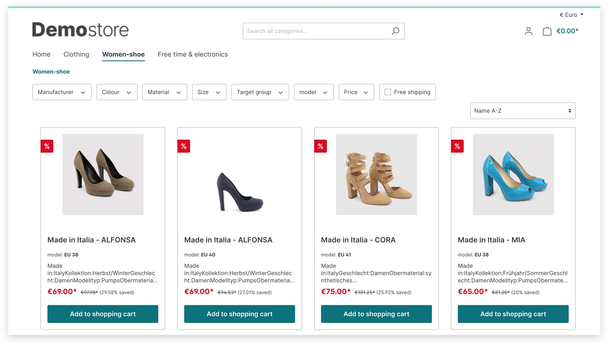
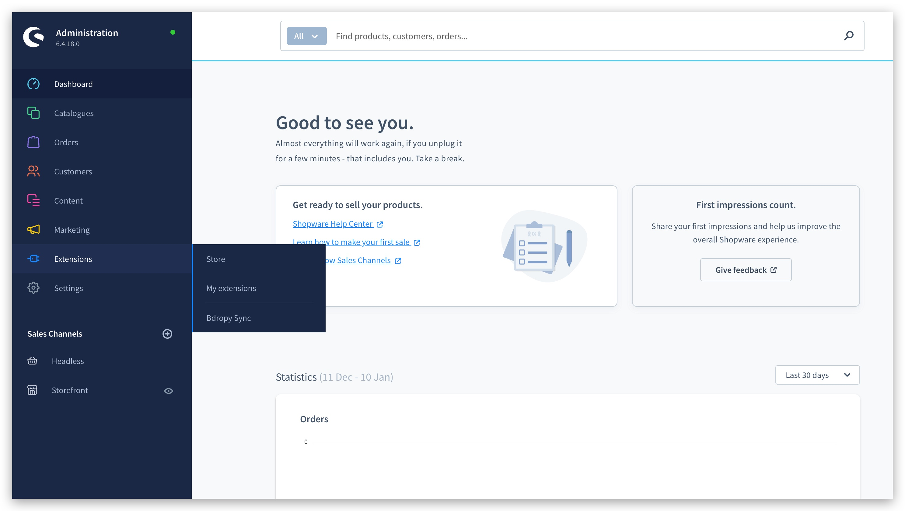
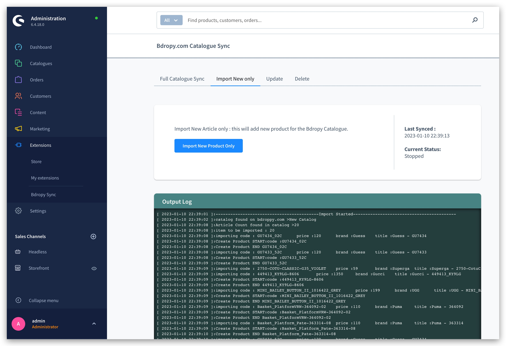
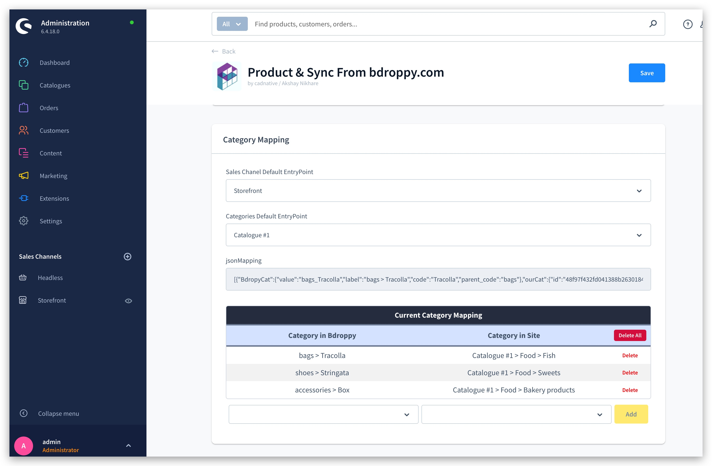
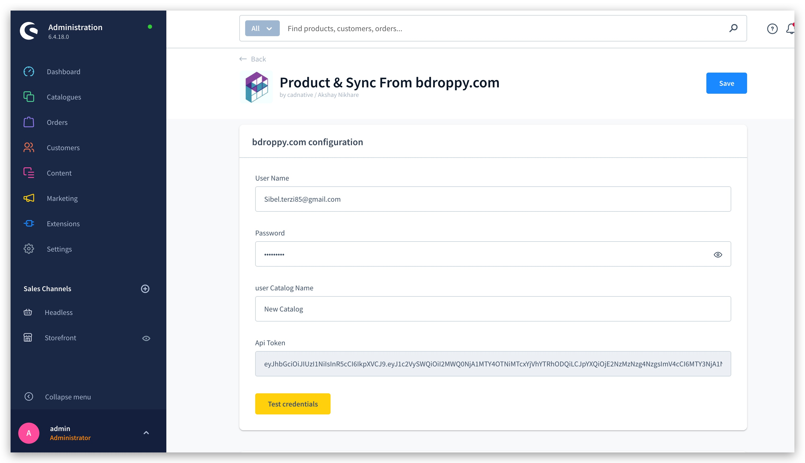
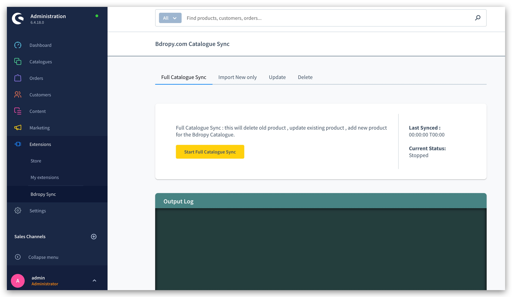
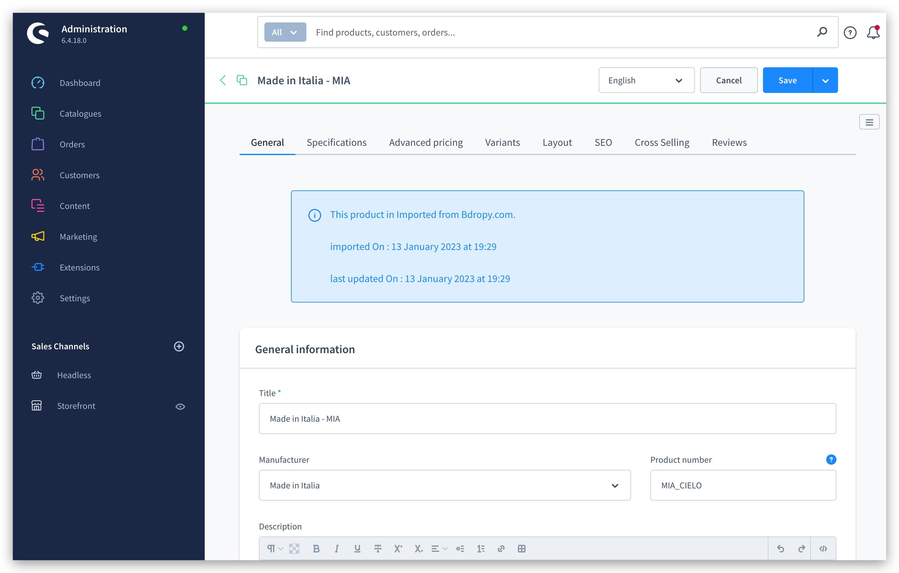
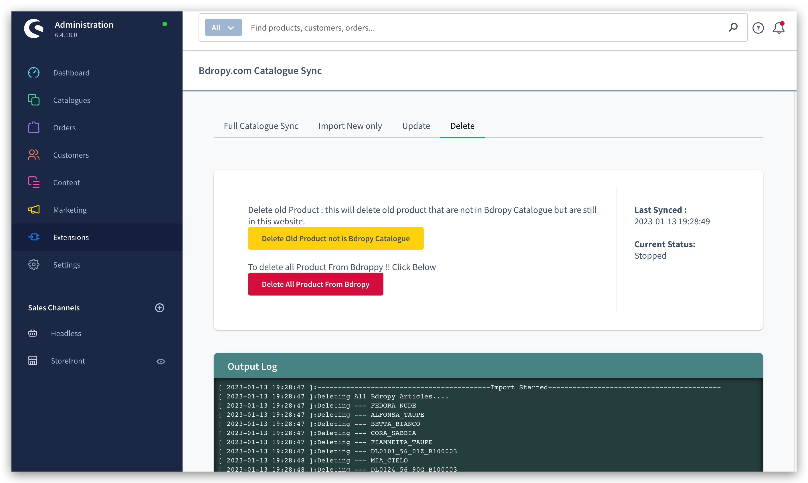

# Shopware 6 Plugins - slox_product_sync

SW6-Bdropy-Product-Sync is a plugin for the Shopware 6 CMS platform that enables users to easily sync products from Bdropy.com, a leading dropshipping company, with their online store. This user-friendly plugin automates the process of importing and syncing products, saving valuable time and resources. With SW6-Bdropy-Product-Sync, users can expand their product offerings without investing in inventory, making it an essential tool for anyone looking to streamline their dropshipping business and grow their online store.

## Screenshots

  
  
  
  
  
  
  
  
  

## Prerequisites
Before installing this plugin, make sure you have the following:

  - A Bdroppy account with your username and password.

## How to Install the Plugin 
To install and use the plugin, follow these steps:

1. Download our plugin from the Shopware store or the Plugin Manager in your Shopware Backend.
2. Install and activate the plugin.
3. Go to Plugins > Config and enter your bdropy credential, then save it.
4. Go to admin > extensions > productimport (<shop>/admin#/slox/bdropy/productimport/) to start using the plugin.

