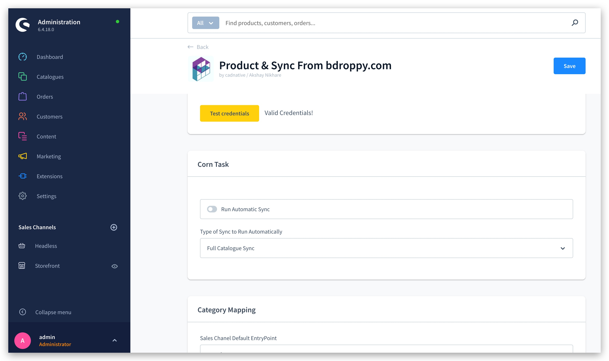

# Shopware 6 Plugins - slox_product_sync

### Screenshot
<p align="left">
  
  
  
  
  
  
  
  
  
</p>

### PreRequisite
    1. FTP credentials 

### Installation 
    1. Download our plugin , From Shopware store or in the Plugin Manager in your Shopware Backend
    2. Install and Activate the plugin 
    3. Now go to Plugins > Config , and enter your FTP key and then save it.
    5. save everything , and create a test order .


## Use

## How to install the Plugin
### Composer install (recommended)
```
bin/console plugin:refresh
bin/console plugin:install --activate Plugin
```
#### Building
The composer install does not come with compiled javascript. You will have to build/compile your administration and storefront javascript.

In case you are using the production template, the command below should do the trick.
```
bin/build.sh
```
#### Build Assets
Building the javascript & css will still be needed.
```
bin/build.sh
```


